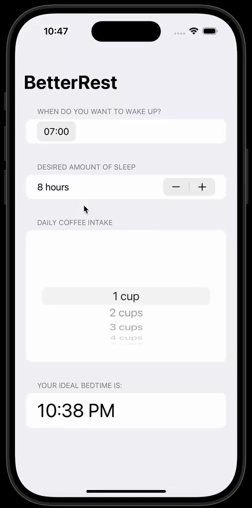

# BetterRest

### Are you a coffee drinker and would like to improve the quality of your sleep? I've got you covered with "BetterRest".
### Know how much sleep you should get in order to feel rested. 😴💤

### BetterRest is a simple app that recommends you the ideal bedtime based on how much coffee they drank throughout the day, how much sleep they would like to have and when they wish to wake up.
### BetterRest uses a regression algorithm to come up with a quasi-accurate prediction.

### DISCLAIMER:

Keep in mind that the application is meant to work as a <em>suggestion</em> and not as a health-related recommendation. You should always refer to your doctor for any health-related advice.

### NOTE:

The App was built while attending the <a href="https://www.hackingwithswift.com/100/swiftui">100 Days of SwiftUI</a> course issued by Paul Hudson.
